<div align="center">

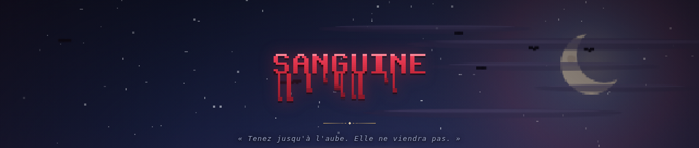

**[▶ JOUER MAINTENANT](https://sanguine.ascencia.re)** · **[Manuel](https://pedrokarim.github.io/sanguine/)**

[](https://sanguine.ascencia.re)
[](https://pedrokarim.github.io/sanguine/)
[](LICENSE)


</div>

---

Un **survivor-like** (*bullet heaven*) jouable directement dans le navigateur. Vous ne tirez
jamais : vos armes se déclenchent seules. Toute la profondeur vient du choix des améliorations
entre deux vagues, et de la construction d'un build qui transforme un chasseur fragile en
machine à effacer l'écran.

Une partie dure **30 minutes**. Le temps est le seul véritable adversaire.

> **Aucune dépendance runtime. Aucun fichier binaire.**
> Sprites, animations, décor, biomes, illustration des menus, ornements d'interface, logo,
> curseur et sons sont **générés par le code** au démarrage. Le jeu entier tient en 60 ko
> compressés et fonctionne hors ligne.

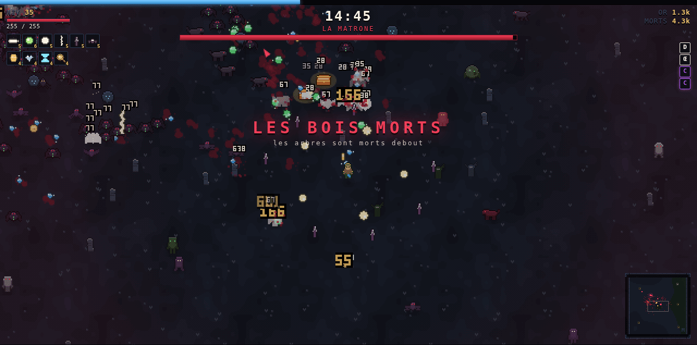

---

## Aperçu

|  |  |
|---|---|
| 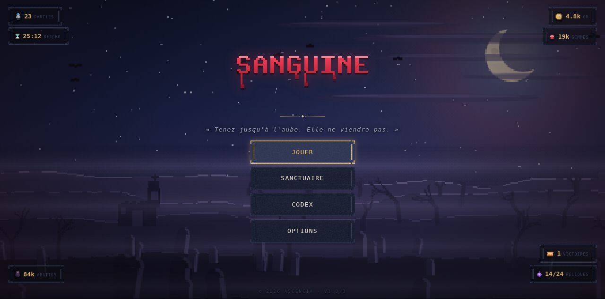 | 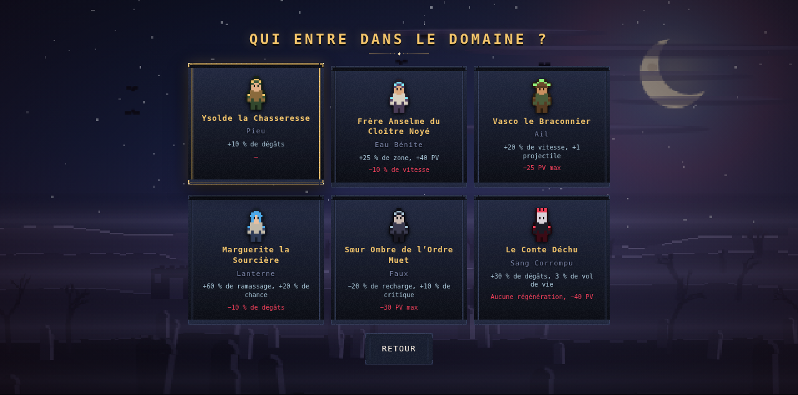 |
| **Écran titre** – scène nocturne en six couches animées par parallaxe, logo pixel dont le sang coule, compteurs répartis dans les coins | **Six personnages**, chacun avec son arme de départ, son bonus et son défaut. La progression vers chaque déblocage est chiffrée |
| 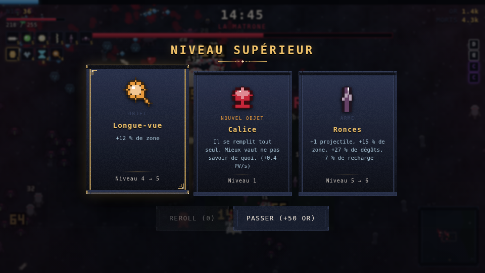 | 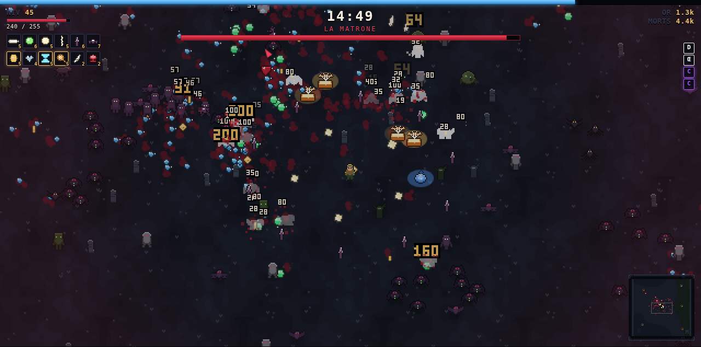 |
| **Un choix à chaque niveau** – trois cartes tirées par catégorie, la horde figée derrière | **24 reliques**, dont quatre maudites : puissantes, mais elles se paient |
| 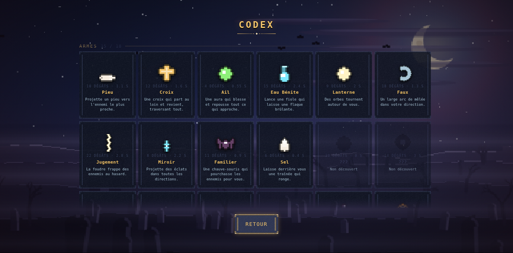 | 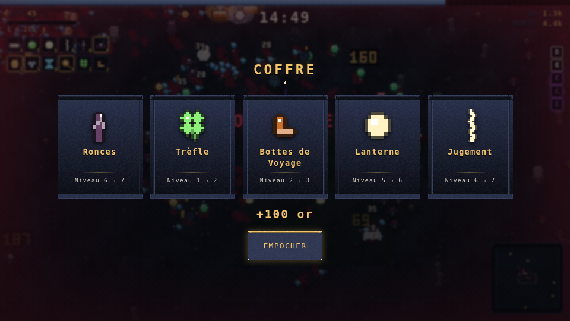 |
| **Codex de 77 entrées** à sprites animés, silhouettées tant qu'elles ne sont pas découvertes | **Bestiaire** – dix-huit créatures, leurs statistiques et leur comportement |
| 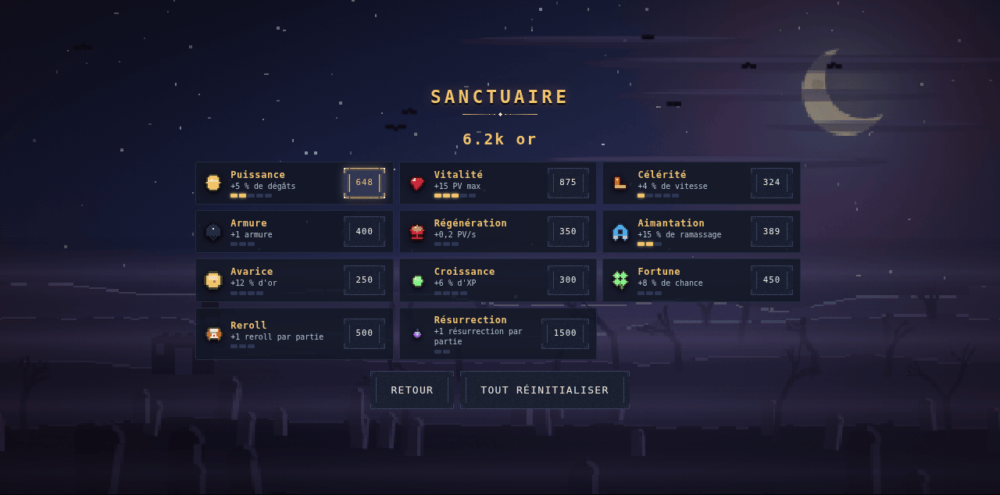 | 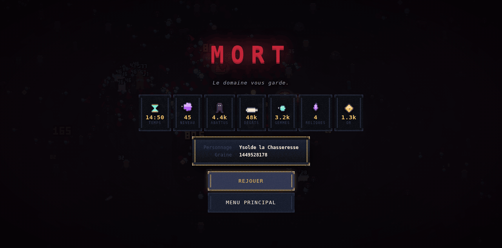 |
| **Sanctuaire** – l'or survit à la mort et achète des améliorations permanentes | **Bilan de fin**, graine comprise pour rejouer exactement le même run |

---

## Contenu

| | |
|---|---|
| **18 armes** | + 15 évolutions, débloquées uniquement par les coffres |
| **12 passifs** | 6 emplacements d'armes, 6 de passifs – le plafond force les vrais choix |
| **24 reliques** | Objets uniques, hors emplacements, dont 4 **maudites** |
| **13 ennemis** | 9 comportements d'IA distincts |
| **5 boss** | Dont la Faucheuse, invulnérable, qui met fin à la partie |
| **6 personnages** | 4 à débloquer, avec progression affichée |
| **5 biomes** | Composition d'ennemis et effets passifs propres |
| **7 structures** | Autel, bûcher, obélisque, puits, ossuaire, chapelle, cairn |
| **11 améliorations** | Méta-progression permanente au Sanctuaire |
| **Codex** | 77 entrées à sprites animés – armes, évolutions, bestiaire, reliques |
| **Reprise de partie** | Un onglet fermé ne coûte plus la partie en cours |
| **Boutique** | 22 cosmétiques — teintes, traînées, thèmes d'interface, curseurs |
| **Collection** | 42 pièces disséminées, trouvables à la résonance, et leur archive |
| **Accessibilité** | Échelle d'interface, contraste, animations, vitesse de jeu, repère joueur |

---

## Jouer

| Action | Clavier | Manette | Tactile |
|---|---|---|---|
| Déplacement | `ZQSD` / `WASD` / flèches | Stick gauche | Glisser (joystick virtuel) |
| Pause | `Échap` / `P` | Start | – |
| Valider | `Entrée` / `Espace` / clic | A | Tap |
| Minimap | `M` | – | – |

La minimap sert aussi de détecteur : elle pulse en direction de ce qui est enfoui à proximité.

| Plein écran | `F` | – | – |

**Il n'y a pas de touche d'attaque.** C'est le genre qui veut ça.

AZERTY et QWERTY fonctionnent simultanément : les touches sont lues par **code physique**.

<details>
<summary>Outils de développement</summary>

| Touche | Effet |
|---|---|
| `~` | Compteurs de debug : FPS, entités, temps par système, et le rapport d'échelle physique (`net` / `rééchantillonné`) |
| `F1` | +10 niveaux · `F2` +1 minute · `F3` soins complets |
| `F4` | Tue tout à l'écran · `F5` +10 000 or |
| `F6` | Fait tomber une relique · `F7` fait tomber un coffre |

La console expose `window.sanguine` : `.snapshot()`, `.world`, `.startRun(id)`, `.exportSprites()`.

</details>

---

## Développement

```bash
pnpm install
pnpm dev        # serveur de développement → http://localhost:5180
pnpm build      # production → dist/
pnpm preview    # sert le build
```

`dist/index.html` fonctionne aussi en `file://` et hors ligne : rien n'est chargé depuis le
réseau.

### Docker

```bash
docker compose up -d --build     # → http://127.0.0.1:4020
```

Mise en production complète dans **[DEPLOY.md](DEPLOY.md)**.
Publication du manuel : `./tools/publish-docs.sh`.

---

## Architecture

```
src/
├── core/     boucle à pas fixe, RNG déterministe, grille spatiale, entrées, sauvegarde
├── gfx/      palette, primitives pixel, générateurs de sprites, caméra, particules, rendu
├── audio/    synthétiseur Web Audio + musique adaptative en couches
├── data/     tables de contenu pures (aucune dépendance)
├── game/     joueur, ennemis, armes, terrain, butin, director, améliorations
└── ui/       HUD, écrans, minimap, logo animé, illustration des menus, ornements
```

| Choix | Raison |
|---|---|
| **Canvas 2D** plutôt que WebGL | Suffisant jusqu'à ~2000 sprites, sans la complexité des shaders |
| **Pools pré-alloués** plutôt qu'un ECS | Peu de types d'entités, énormément d'instances |
| **Grille de hachage** reconstruite chaque frame | Plus rapide qu'une mise à jour incrémentale, impossible à désynchroniser |
| **HUD en DOM** | Texte net à toute résolution, accessible, gratuit dans la boucle de rendu |
| **Monde déterministe par position** | Monde infini à coût mémoire nul, runs rejouables à la graine |
| **Facteur d'échelle entier en pixels physiques** | Un pixel de jeu vaut toujours un nombre entier de pixels écran, à n'importe quel `devicePixelRatio` |

La résolution logique s'adapte à la fenêtre en conservant le facteur entier : pas de bandes
noires, et un pixel art net y compris sous une mise à l'échelle Windows à 125 % ou 150 %.

Mesuré sous charge : **60 fps constants** avec 344 ennemis (`update` 0,9 ms, `render` 2,4 ms).

---

## Documentation

La documentation de conception est en français et sert de **source de vérité** : les tables de
`src/data/` doivent la refléter.

| Document | Contenu |
|---|---|
| [`docs/00-vision.md`](docs/00-vision.md) | Pitch, piliers, contraintes, critères de réussite |
| [`docs/01-game-design.md`](docs/01-game-design.md) | Boucles, statistiques, formules, sauvegarde, accessibilité |
| [`docs/02-content-bible.md`](docs/02-content-bible.md) | Armes, passifs, reliques, ennemis, biomes, structures |
| [`docs/03-technical-architecture.md`](docs/03-technical-architecture.md) | Stack, modules, budget de performance |
| [`docs/04-art-direction.md`](docs/04-art-direction.md) | Palette, pipeline procédural, game feel, erreurs corrigées |
| [`docs/05-audio-design.md`](docs/05-audio-design.md) | Synthèse, catalogue d'effets, musique adaptative |
| [`docs/06-roadmap.md`](docs/06-roadmap.md) | Jalons, hors périmètre, dette technique assumée |

---

## Équilibrage mesuré, pas deviné

Les courbes ne sont pas réglées à l'intuition mais **mesurées par un bot** qui joue réellement :
il fuit la pression locale des ennemis, dérive vers les gemmes et choisit ses cartes.

Deux réglages de densité ont été mesurés puis rejetés. Le second est le plus instructif :

| Réglage | Résultat mesuré |
|---|---|
| `0.9 + min × 0.55` | ~20 ennemis à l'écran, niveau 8 seulement à 3 min 30 : trop vide |
| `1.6 + min × 1.05` | 474 ennemis à 6 min, **une seule arme au niveau 5**, mort à 6 min 48 |
| `1.1 + min × 0.70` | Niveau 14 à 4 min 30, 4 armes, 745 morts, 60 fps – **retenu** |

Au-delà d'un certain seuil, **augmenter la densité réduit la progression** : le joueur ne tue
plus assez vite, ne ramasse plus de gemmes, et la courbe d'XP s'effondre pendant que l'écran se
remplit.

---

## Licence

[MIT](LICENSE) – faites-en ce que vous voulez.

<div align="center">
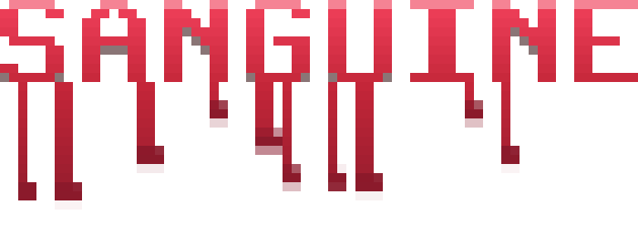
<br>
<sub>© 2026 Ascencia</sub>
</div>
